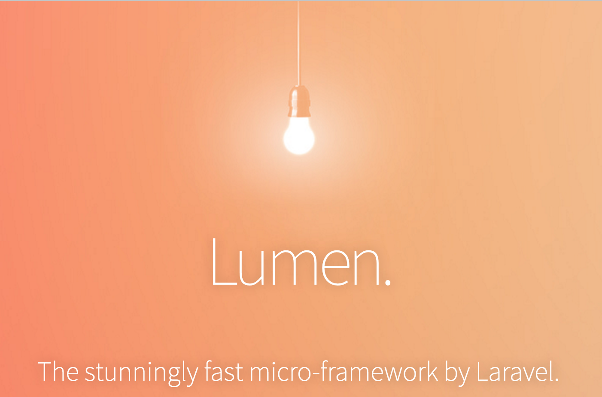
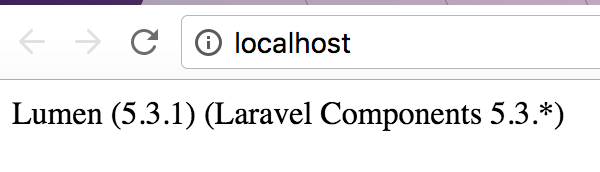

# Docker + Lumen with Nginx and MySQL



This setup is great for writing quick apps in PHP using Lumen from an any Docker client. It uses docker-compose to setup the application services.

## Clone this repo

```bash
git clone https://github.com/saada/docker-lumen.git
cd docker-lumen
```

## Create Lumen App

now, create the app in the `images\php` directory named `app`

```bash
cd images/php
docker run --rm -it -v $(pwd):/app saada/lumen-cli lumen new app
```

### Configuration

To change configuration values, look in the `docker-compose.yml` file and change the `php` container's environment variables. These directly correlate to the Lumen environment variables.

## Docker Setup

### [Docker for Mac](https://docs.docker.com/docker-for-mac/)

### [Docker for Windows](https://docs.docker.com/docker-for-windows/)

### [Docker for Linux](https://docs.docker.com/engine/installation/linux/)

### Build & Run

```bash
docker-compose up --build -d
```

Navigate to [http://localhost:80](http://localhost:80) and you should see something like this


Success! You can now start developing your Lumen app on your host machine and you should see your changes on refresh! Classic PHP development cycle. A good place to start is `images/php/app/routes/web.php`.

Feel free to configure the default port 80 in `docker-compose.yml` to whatever you like.

### Stop Everything

```bash
docker-compose down
```

## Contribute

Submit a Pull Request!
